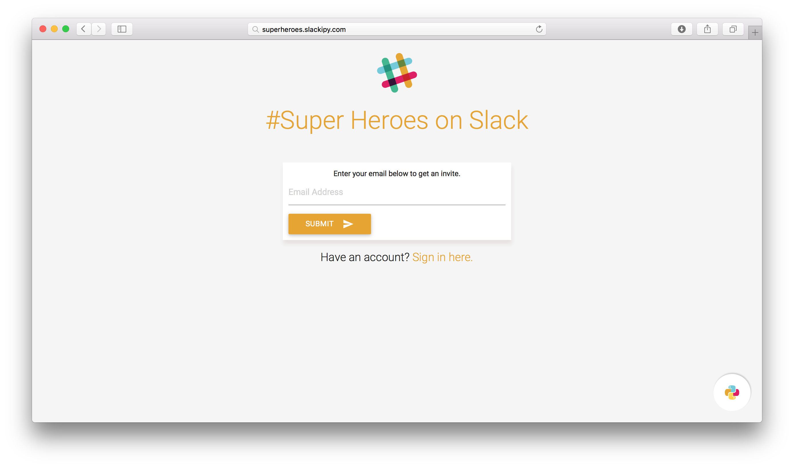
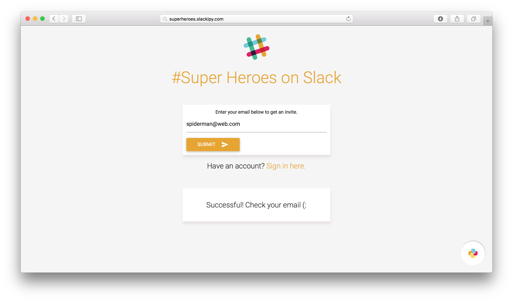

# Slackipy

Slackipy is a little web server which helps you automate user invites to your Slack team. It is written using [Flask](http://flask.pocoo.org) and for templating it uses [Jinja2](http://jinja.pocoo.org), hence it is very easy to customise and add new features like captcha, password requirement etc on top of it.

## Features

1. Very easy to install, configure and customize
2. Single click installations on Heroku or Openshift
3. It is responsive and uses [Material Design](http://materializecss.com)
4. Works without JavaScript

## Installation 

You need following:

1. Slack Team ID (`SLACK_TEAM_ID`): Your Slack team ID or sub domain. For example in `superheroes.slack.com`, `superheroes` is the Slack team ID.

2. Slack API Token (`SLACK_API_TOKEN`): You need to generate API token from your admin account. Go to https://api.slack.com/web and generate one.

3. Flask Secret Key (`FLASK_SECRET_KEY`): Any random string, it will be used to protect the app from CSRF attacks. It will also come handy if you want to sign cookies.

# Heroku 

# Openshift 

Once you have installed and [setup `rhc`](https://developers.openshift.com/en/managing-client-tools.html), run the following:

    rhc create-app slackipy python-3.3 --from-code https://github.com/avinassh/slackipy SLACK_API_TOKEN="your-token-here" SLACK_TEAM_ID="team-id" FLASK_SECRET_KEY="some-random-key"

# Custom Installation 

Check [Flask Deployment](http://flask.pocoo.org/docs/0.10/deploying) if you want to do custom deployment. You can serve app from `wsgi.py`:

    from wsgi import application

`SLACK_TEAM_ID`, `SLACK_API_TOKEN` and `FLASK_SECRET_KEY` should be set as environment variables.

# Screenshots 

# Development

To install locally, clone the repo, install the requirements and run `wsgi.py`:

    $ git clone https://github.com/avinassh/slackipy
    $ cd slackipy
    $ pyvenv venv
    $ source venv/bin/activate
    $ pip install -r requirements.txt
    $ python wsgi.py

The app will be available at [localhost:8051](http://localhost:8051)

# Credits

The UI design is done by [Anirudh Varma](https://github.com/anirudhvarma12) and slackipy logo is designed by [Harshal Gupta](https://github.com/harshalbot).

# License

The mighty MIT license. Please check `LICENSE` for more details.
